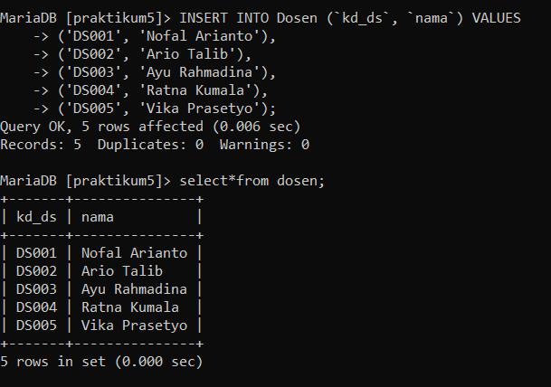
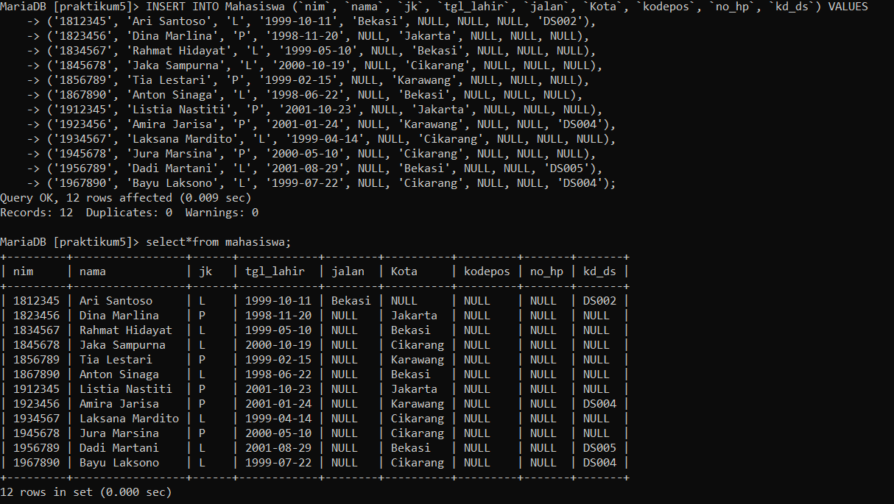
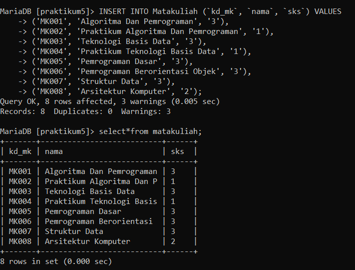
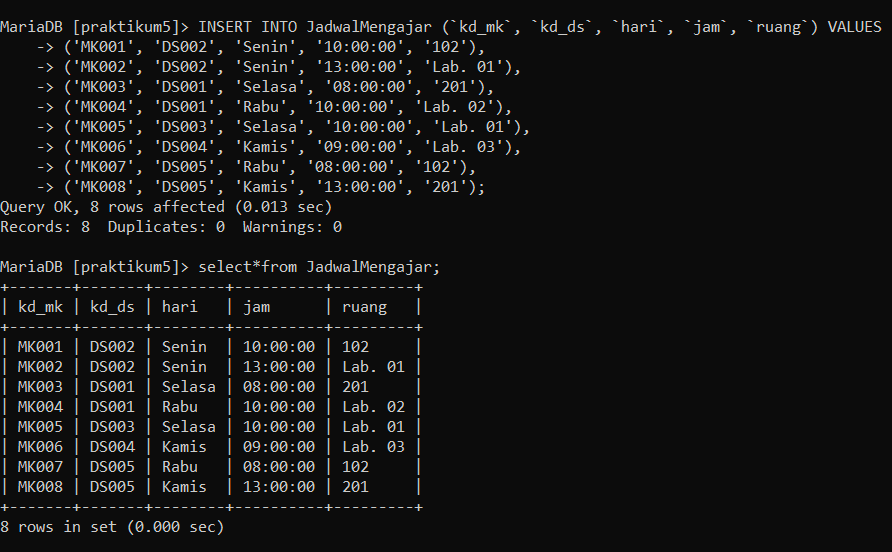
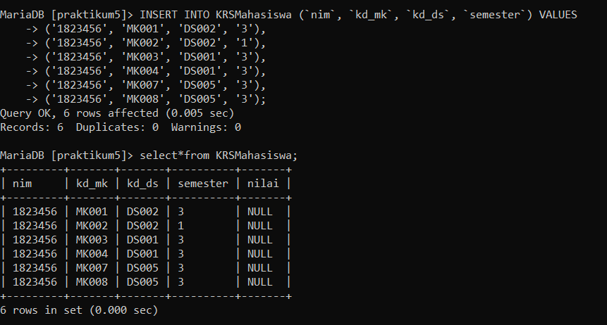
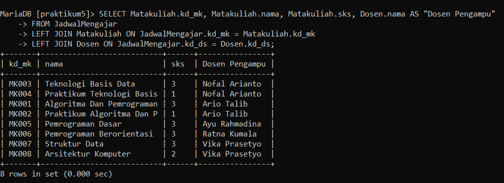
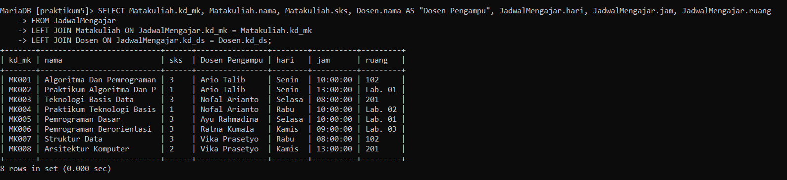
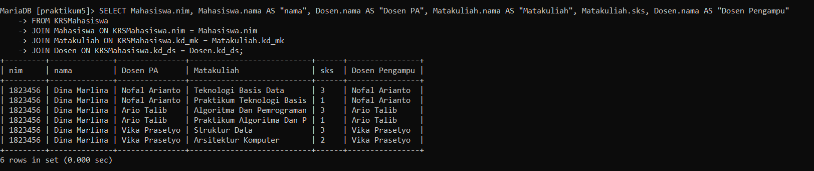

# Tugas Praktikum 4 SQL Join { Pertemuan ke 11 } 

|**Nama**|**NIM**|**Kelas**|**Matkul**|
|----|---|-----|------|
|Gladis Toti Anggraini |312310566|TI.23.A5|Basis Data|

## Latihan Praktikum
**Tabel dosen**

```
CREATE TABLE Dosen(
kd_ds VARCHAR(10) NOT NULL PRIMARY KEY,
nama VARCHAR(25) NOT NULL
);

INSERT INTO Dosen (`kd_ds`, `nama`) VALUES
('DS001', 'Nofal Arianto');
('DS002', 'Ario Talib');
('DS003', 'Ayu Rahmadina');
('DS004', 'Ratna Kumala');
('DS005', 'Vika Prasetyo');

SELECT*FROM Dosen;
```



**Tabel Mahasiswa**

```
CREATE TABLE Mahasiswa (
    nim VARCHAR(10) NOT NULL PRIMARY KEY,
    nama VARCHAR(25) NOT NULL,
    jk ENUM ('L','P'),
    tgl_lahir DATE,
    jalan VARCHAR(30),
    Kota VARCHAR(15),
    kodepos VARCHAR(15),
    no_hp VARCHAR(15),
    kd_ds VARCHAR(10),
    CONSTRAINT fk_Dosen FOREIGN KEY (kd_ds) REFERENCES Dosen(kd_ds)
);

INSERT INTO Mahasiswa (`nim`, `nama`, `jk`, `tgl_lahir`, `jalan`, `Kota`, `kodepos`, `no_hp`, `kd_ds`) VALUES
('1812345', 'Ari Santoso', 'L', '1999-10-11', 'Bekasi', NULL, NULL, NULL, 'DS002'),
('1823456', 'Dina Marlina', 'P', '1998-11-20', NULL, 'Jakarta', NULL, NULL, NULL),
('1834567', 'Rahmat Hidayat', 'L', '1999-05-10', NULL, 'Bekasi', NULL, NULL, NULL),
('1845678', 'Jaka Sampurna', 'L', '2000-10-19', NULL, 'Cikarang', NULL, NULL, NULL),
('1856789', 'Tia Lestari', 'P', '1999-02-15', NULL, 'Karawang', NULL, NULL, NULL),
('1867890', 'Anton Sinaga', 'L', '1998-06-22', NULL, 'Bekasi', NULL, NULL, NULL),
('1912345', 'Listia Nastiti', 'P', '2001-10-23', NULL, 'Jakarta', NULL, NULL, NULL),
('1923456', 'Amira Jarisa', 'P', '2001-01-24', NULL, 'Karawang', NULL, NULL, 'DS004'),
('1934567', 'Laksana Mardito', 'L', '1999-04-14', NULL, 'Cikarang', NULL, NULL, NULL),
('1945678', 'Jura Marsina', 'P', '2000-05-10', NULL, 'Cikarang', NULL, NULL, NULL),
('1956789', 'Dadi Martani', 'L', '2001-08-29', NULL, 'Bekasi', NULL, NULL, 'DS005'),
('1967890', 'Bayu Laksono', 'L', '1999-07-22', NULL, 'Cikarang', NULL, NULL, 'DS004');

SELECT*FROM Mahasiswa;
```



**Tabel MataKuliah**

```
CREATE TABLE Matakuliah(
    kd_mk VARCHAR(10) NOT NULL PRIMARY KEY,
    nama VARCHAR(25) NOT NULL,
    sks VARCHAR(30)
);

INSERT INTO Matakuliah (`kd_mk`, `nama`, `sks`) VALUES
('MK001', 'Algoritma Dan Pemrograman', '3'),
('MK002', 'Praktikum Algoritma Dan Pemrograman', '1'),
('MK003', 'Teknologi Basis Data', '3'),
('MK004', 'Praktikum Teknologi Basis Data', '1'),
('MK005', 'Pemrograman Dasar', '3'),
('MK006', 'Pemrograman Berorientasi Objek', '3'),
('MK007', 'Struktur Data', '3'),
('MK008', 'Arsitektur Komputer', '2');

SELECT*FROM MataKuliah;
```




**Tabel JadwalMengajar**

```
CREATE TABLE JadwalMengajar(
    kd_mk VARCHAR(10) NOT NULL,
    kd_ds VARCHAR(10) NOT NULL,
    hari ENUM('Senin', 'Selasa', 'Rabu', 'Kamis'),
    jam TIME NOT NULL,
    ruang VARCHAR(50),
    PRIMARY KEY(kd_mk, kd_ds),
    CONSTRAINT fk_Matakuliah FOREIGN KEY (kd_mk) REFERENCES Matakuliah(kd_mk),
    CONSTRAINT fk_Dosen_Jadwal FOREIGN KEY (kd_ds) REFERENCES Dosen(kd_ds)
);

INSERT INTO JadwalMengajar (`kd_mk`, `kd_ds`, `hari`, `jam`, `ruang`) VALUES
('MK001', 'DS002', 'Senin', '10:00:00', '102'),
('MK002', 'DS002', 'Senin', '13:00:00', 'Lab. 01'),
('MK003', 'DS001', 'Selasa', '08:00:00', '201'),
('MK004', 'DS001', 'Rabu', '10:00:00', 'Lab. 02'),
('MK005', 'DS003', 'Selasa', '10:00:00', 'Lab. 01'),
('MK006', 'DS004', 'Kamis', '09:00:00', 'Lab. 03'),
('MK007', 'DS005', 'Rabu', '08:00:00', '102'),
('MK008', 'DS005', 'Kamis', '13:00:00', '201');

SELECT*FROM JadwalMengajar;
```



**Tabel KRSMahasiswa**

```
CREATE TABLE KRSMahasiswa(
    nim VARCHAR(10) NOT NULL,
    kd_mk VARCHAR(10) NOT NULL,
    kd_ds VARCHAR(10) NOT NULL,
    semester VARCHAR(15),
    nilai VARCHAR(15),
    PRIMARY KEY(nim, kd_mk, kd_ds),
    CONSTRAINT fk_Mahasiswa FOREIGN KEY (nim) REFERENCES Mahasiswa(nim),
    CONSTRAINT fk_Matakuliah_KRS FOREIGN KEY (kd_mk) REFERENCES Matakuliah(kd_mk),
    CONSTRAINT fk_Dosen_KRS FOREIGN KEY (kd_ds) REFERENCES Dosen(kd_ds)
);

INSERT INTO KRSMahasiswa (`nim`, `kd_mk`, `kd_ds`, `semester`) VALUES
('1823456', 'MK001', 'DS002', '3'),
('1823456', 'MK002', 'DS002', '1'),
('1823456', 'MK003', 'DS001', '3'),
('1823456', 'MK004', 'DS001', '3'),
('1823456', 'MK007', 'DS005', '3'),
('1823456', 'MK008', 'DS005', '3');

SELECT*FROM KRSMahasiswa;
```




## Latihan

**1.JOIN table Mahasiswa dan Dosen**

```
SELECT Mahasiswa.nim, Mahasiswa.nama, Mahasiswa.jk, Dosen.nama AS "Dosen PA"
FROM Mahasiswa INNER JOIN Dosen ON Dosen.kd_ds = Mahasiswa.kd_ds;
```

![image].(ss/join table Mahasiswa dan Dosen.png)

**2.LEFT JOIN table Mahasiswa dan Dosen**

```
SELECT Mahasiswa.nim, Mahasiswa.nama, Mahasiswa.jk, Dosen.nama AS "Dosen PA"
FROM Mahasiswa LEFT JOIN Dosen ON Dosen.kd_ds = Mahasiswa.kd_ds;
```
[image](ss/LEFT JOIN table Mahasiswa dan Dosen.png)
![image].(ss/LEFT JOIN table Mahasiswa dan Dosen.png

**3.JOIN table JadwalMengajar, Dosen, dan Matakuliah**

```
SELECT Matakuliah.kd_mk, Matakuliah.nama, Matakuliah.sks, Dosen.nama AS "Dosen Pengampu"
FROM JadwalMengajar
LEFT JOIN Matakuliah ON JadwalMengajar.kd_mk = Matakuliah.kd_mk
LEFT JOIN Dosen ON JadwalMengajar.kd_ds = Dosen.kd_ds;
```



**4.JOIN table JadwalMengajar, Dosen, dan Matakuliah**

```
SELECT Matakuliah.kd_mk, Matakuliah.nama, Matakuliah.sks, Dosen.nama AS "Dosen Pengampu", JadwalMengajar.hari, JadwalMengajar.jam, JadwalMengajar.ruang
FROM JadwalMengajar
LEFT JOIN Matakuliah ON JadwalMengajar.kd_mk = Matakuliah.kd_mk
LEFT JOIN Dosen ON JadwalMengajar.kd_ds = Dosen.kd_ds;
```



**5.JOIN tabel KrsMahasiswa, Mahasiswa, Matakuliah, dan Dosen**

```
SELECT Mahasiswa.nim, Mahasiswa.nama AS "nama", Dosen.nama AS "Dosen PA", Matakuliah.nama AS "Matakuliah", Matakuliah.sks, Dosen.nama AS "Dosen Pengampu"
FROM KRSMahasiswa
JOIN Mahasiswa ON KRSMahasiswa.nim = Mahasiswa.nim
JOIN Matakuliah ON KRSMahasiswa.kd_mk = Matakuliah.kd_mk
```




